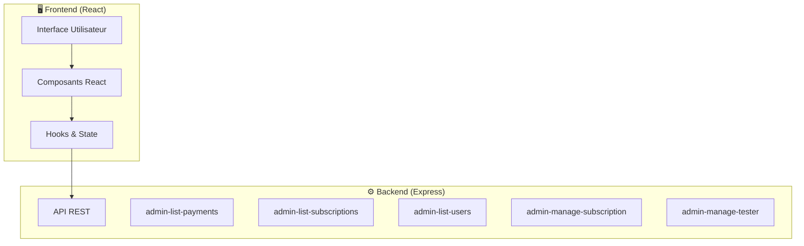
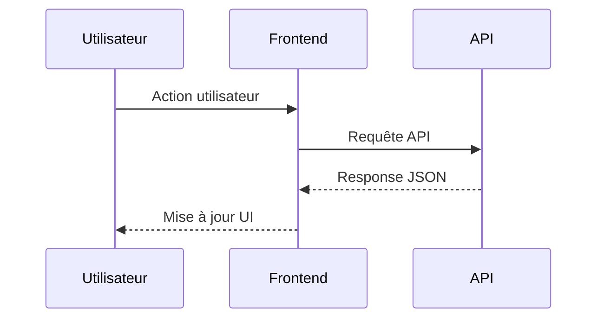

# Architecture - inopay

## Diagramme Principal

```mermaid
graph TD
    subgraph Frontend["🖥️ Frontend (React)"]
        UI[Interface Utilisateur]
        Components[Composants React]
        Hooks[Hooks & State]
    end
    
    subgraph Backend["⚙️ Backend (Express)"]
        API[API REST]
        admin_list_payments[admin-list-payments]
        admin_list_subscriptions[admin-list-subscriptions]
        admin_list_users[admin-list-users]
        admin_manage_subscription[admin-manage-subscription]
        admin_manage_tester[admin-manage-tester]
    end
    
    
    
    UI --> Components
    Components --> Hooks
    Hooks --> API
    
```

## Flux de Données

```mermaid
sequenceDiagram
    participant U as Utilisateur
    participant F as Frontend
    participant A as API
    
    
    U->>F: Action utilisateur
    F->>A: Requête API
    
    
    A-->>F: Response JSON
    F-->>U: Mise à jour UI
```
